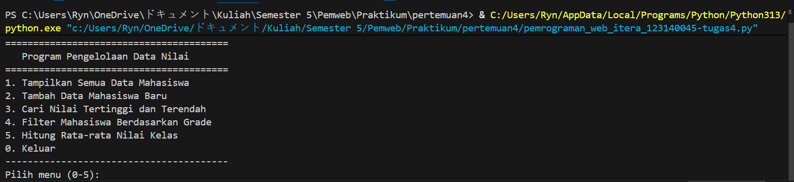
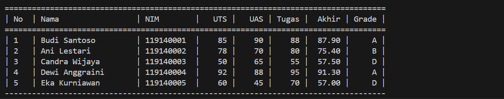

# 🐍 Program Pengelolaan Data Nilai Mahasiswa

Ini adalah proyek tugas untuk **Praktikum Python Dasar**. Program ini merupakan aplikasi konsol (CLI) sederhana yang dibangun dengan Python untuk mengelola data nilai mahasiswa, lengkap dengan menu interaktif.

## 📋 Fitur Utama

Program ini memiliki beberapa fungsionalitas utama yang dapat diakses melalui menu:

1.  **Tampilkan Semua Data**: Menampilkan data lengkap seluruh mahasiswa (termasuk nilai akhir dan grade) dalam format tabel yang rapi.
2.  **Tambah Data Mahasiswa Baru**: Memungkinkan pengguna untuk menambahkan data mahasiswa baru (Nama, NIM, Nilai UTS, UAS, dan Tugas) melalui input terminal.
3.  **Cari Nilai Tertinggi dan Terendah**: Menemukan dan menampilkan data mahasiswa dengan nilai akhir tertinggi dan nilai akhir terendah.
4.  **Filter Mahasiswa Berdasarkan Grade**: Menyaring dan menampilkan daftar mahasiswa yang mendapatkan grade tertentu (A, B, C, D, atau E).
5.  **Hitung Rata-rata Nilai Kelas**: Menghitung dan menampilkan nilai rata-rata akhir dari seluruh mahasiswa yang terdaftar.
6.  **Keluar**: Menghentikan program.

## 🧮 Logika Perhitungan

* **Nilai Akhir**: Dihitung berdasarkan bobot yang telah ditentukan:
    * `30% Nilai UTS`
    * `40% Nilai UAS`
    * `30% Nilai Tugas`
* **Grade**: Ditentukan berdasarkan rentang nilai akhir:
    * **A**: $\ge 80$
    * **B**: $\ge 70$
    * **C**: $\ge 60$
    * **D**: $\ge 50$
    * **E**: $< 50$

## 🛠️ Teknologi yang Digunakan

* **Python 3.8+**
* Hanya menggunakan modul standar bawaan Python (tidak ada *library* eksternal).

## 🚀 Cara Menjalankan

1.  Pastikan Anda telah meng-install **Python 3.8** atau versi yang lebih baru di sistem Anda.
2.  Clone atau unduh repository ini.
3.  Buka terminal atau Command Prompt.
4.  Navigasi ke direktori tempat file `manajemen_nilai.py` berada.
    ```bash
    # Contoh navigasi ke folder pertemuan
    cd pemrograman_web_itera_119140001/johndoe_119140001_pertemuan6/
    ```
5.  Jalankan program menggunakan perintah berikut:
    ```bash
    python manajemen_nilai.py
    ```
6.  Menu program akan muncul di terminal, dan Anda dapat mulai menggunakan fitur-fiturnya.






## 📁 Struktur Folder

Struktur folder :

pemrograman_web_itera_123140045/
│
└── pertemuan[4]/
    │
    ├── manajemen_nilai.py   <-- (File program ini)
    └── README.md            <-- (File ini)
    └── src/                 <-- (File Gambar)
        └──data.png
        └──main.png
```

## 👤 Author

* **Nama:** Muharyan Syaifullah
* **NIM:** 123140045
